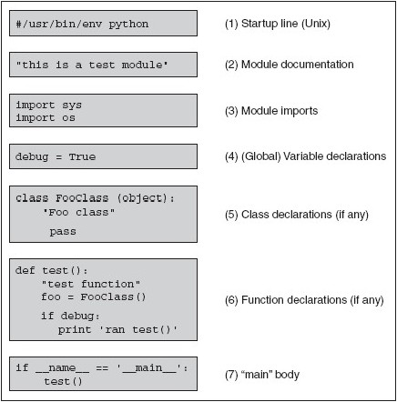

python基础
============================

### 语句和语法

* 注释：#
* 换行：\n
* 继续上行：\ ；有两种例外情况：闭合操作符　和　三引号
* 连接两个语句：;
* 代码块用缩进体现
* 文件以模块的形式组织
* python不支持类似x++, --x这样的前/后置自增/减运算
* 多元赋值：x, y, z = 1, 2, 3; x, y = y, x ; (x, y, z) = (1, 2, 3) #建议这种

###　标识符
* 第一个字符是字母或下划线(_)
* 剩下字符是字母或数字或下划线
* 大小写敏感

### 关键字
    import keyword
    keyword.iskeyword('def')
    keyword.kwlist

### 内建

### 风格

    Yes:
    foo = long_function_name(var_one, var_two,
    	                     var_three, var_four)
    def long_function_name(
    	    var_ond,
    	    var_two, var_three)
	x = 1
	y = 2
	long_variable = 3
	i = i + 1
	x = x*2 + 1

### 模块结构和布局

## 返回目录
[README](README.md)